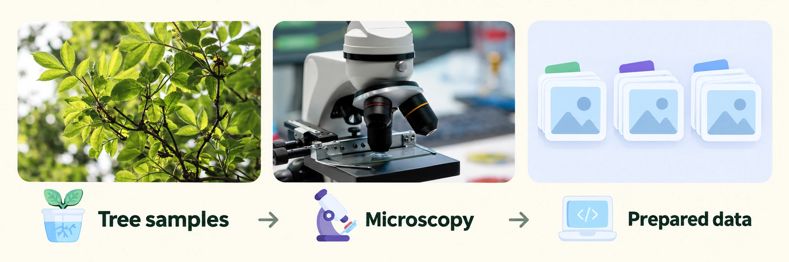

# Woodunnit



A local Python pipeline for microscope images of **fungi (진균, 0)** and
**oomycetes (난균, 1)**. It merges source collections, checks images and
duplicates, groups related images for splitting, and prepares RGB tensors
with OpenCV. Original images and source labels stay intact.

Images now carry **group → genus → species** labels wherever the source supplies
them. The two broad class IDs remain fixed; finer IDs come from each frozen
`taxonomy_map.json`. A shortened schema-3 training record looks like:

```json
{
  "relative_path": "01_tgfc/extracted/example.jpg",
  "source_labels": ["Colletotrichum siamense"],
  "taxonomy": {"group": "fungi", "genus": "Colletotrichum", "species": "Colletotrichum siamense"},
  "targets": {"group": 0, "genus": 0, "species": 0},
  "target_mask": {"group": true, "genus": true, "species": true},
  "split": "train"
}
```

Full records also retain hashes, original metadata, relationships, per-taxon
provenance, and **39,003 original TgFC YOLO boxes**. Whole images remain the
classification inputs. *Neopestalotiopsis* sp. and the soil genera have no
species target; MixedClass has only a fungal target. Missing ranks use `null`
and target ID `-1`. Train and score only ranks whose `target_mask` is true;
known holdout labels without sufficient grouped support also have false masks.

## Datasets and credits

The project selected **5,907 of 6,166 acquired images**: 5,281 fungi and 626 oomycetes.

| Source | Part used | Images used | Terms and credit |
| --- | --- | ---: | --- |
| [TgFC v5](https://doi.org/10.6084/m9.figshare.28855910.v5) | All 5,236 main-release fungal images plus 30 MixedClass images; whole images, not bounding-box crops | 5,266 | [CC BY 4.0](https://creativecommons.org/licenses/by/4.0/) · Maaz Ahmed |
| [IDphy](https://idtools.org/phytophthora/index.cfm?pageID=1547) | Phytophthora microscopy with unambiguous captions and explicit USDA photographer credits | 621 | [Public domain with image-specific exceptions](https://idtools.org/phytophthora/index.cfm?pageID=1543) · Abad et al. |
| [Soil microorganism sample](https://doi.org/10.5281/zenodo.7965200) | Five full fields each of Fusarium, Trichoderma, Verticillium, and Phytophthora | 20 | [CC BY 4.0](https://creativecommons.org/licenses/by/4.0/) · Karol Struniawski |

IDphy credits: Z.G. Abad, T.I. Burgess, A.J. Redford, and J.C. Bienapfl (2023);
USDA APHIS PPQ S&T, Murdoch University, and the World Phytophthora Collection.
Selected photographs credit Gloria Abad or Vickie Brewster; retain each caption's
credit and exceptions. [Associated publication](https://doi.org/10.1094/PDIS-02-22-0448-FE).

The selection excludes 102 IDphy images lacking the required USDA credit
evidence, 3 with ambiguous captions, and all 154 supplied soil crops. Colony
plates and field symptoms were outside the IDphy acquisition. The soil source
is the small public sample, not the larger dataset described in its paper.
These counts describe the saved project selection; new imports report their
own counts and require a local usage record to reproduce that selection.

## Training comparison

A fresh ImageNet-pretrained MobileNetV4 Conv Small
(`mobilenetv4_conv_small.e2400_r224_in1k`, timm/OpenCV, 224 × 224) used the frozen
**4,270 train / 819 validation / 818 test** split. The baseline has the same fresh
random 2/7/67-class heads before optimization; ImageNet's original classifier
does not define these labels. Validation selected **epoch 9 of 15**: three head
warm-up epochs followed by twelve backbone fine-tuning epochs. Both models were
tested after selection, using predicted parents and the same rank masks.

| Level | Test images | Base → trained accuracy | Base → trained macro-F1 |
| --- | ---: | ---: | ---: |
| Group | 818 | 47.19% → 99.76% | 0.3485 → 0.9808 |
| Genus | 814 | 4.18% → 99.63% | 0.0250 → 0.5658 |
| Species | 542 | 2.95% → 98.34% | 0.0182 → 0.6000 |

Only **5 of 67 species** have evaluable holdouts. The model missed the three
soil genera (one test image each), *P. cinnamomi* (two), and *P. infestans* (seven).
High accuracy reflects class imbalance; macro-F1 exposes the weaker fine labels.
Publisher labels remain unreviewed, specimen independence is unverified, and these
test images appeared in earlier experiments. This is an exploratory comparison.

Earlier binary runs used different splits: the first pilot scored 25% on 20
validation images with no final test; the reset improved test accuracy from
32.26% to 99.93% (macro-F1 0.2921 → 0.9971). Stale checkpoints were deleted;
training code, current weights, and detailed results remain outside this repository.

## Setup and use

Requires Python 3.12 or 3.13 and [uv](https://docs.astral.sh/uv/).
Run from the project directory:

```sh
uv sync --locked --extra preprocessing
cp -n configs/ingestion.example.toml configs/ingestion.toml
```

Edit `raw_root` and `output_root` in the copied configuration. Relative paths
resolve from that file's directory; output must be outside the raw image tree.
The raw directory needs `image_inventory.csv` and these prepared collections:

```text
01_tgfc/                    # extracted images, YOLO labels, source metadata
02_idphy_microscopy/         # images, selection metadata, source credits
03_soil_fungi_phytophthora/  # images, source metadata
```

Each collection needs its saved download manifest and metadata. The
[synthetic fixtures](tests/test_adapters.py) show the required structure;
ZIP files alone are not valid inputs.

```sh
uv run --locked woodunnit ingest --config configs/ingestion.toml
uv run --locked woodunnit validate --catalog "data/derived/catalog-<id>"
uv run --locked --extra preprocessing woodunnit preprocess \
  --image data/raw/example.png --output data/derived/example.npz
```

Replace `catalog-<id>` with the directory printed by ingestion. Catalog JSONL
records pair relative image paths with checksums, candidate labels, source
metadata, and relationships; CSV provides a flat view. Preprocessing writes a
float32 `[3, 224, 224]` tensor and JSON transform record. It keeps stored image
orientation, converts to RGB, resizes without cropping, pads, and applies
ImageNet normalization. No model is loaded.

Other commands are `report`, `split`, and `release`; run
`uv run --locked woodunnit COMMAND --help` for arguments. Grouped splits target
70/15/15 and require a catalog-bound usage record ([example](tests/test_experiment_split.py)).
They balance group/genus/species and source while prioritizing training support,
keeping culture references, image families, duplicates, and parent/crop links
together. Sharing a taxon alone does not join images. `label_support.json`
reports actual support per rank and partition; sparse fine labels are masked
for evaluation. Re-ingest older catalogs to recover schema-3 fields; preserve
the old split and bind the same authorized selection to the new catalog.
Reviewed exports additionally require image reviews and group assignments
([example](tests/test_release.py)). Related images stay together, including
links through excluded records. Freeze splits before training; reserve test
for final evaluation. Source labels remain unreviewed, and group proxies do
not establish specimen independence or a confirmed disease diagnosis.

`HierarchicalManifestDataset` reads a frozen split with explicit
`allow_unreviewed=True` and returns `(image, {targets, target_mask})`. Pass an
`OpenCVPreprocessor` as its `transform` to obtain the same tensors used at
inference. `ManifestDataset` retains its reviewed, broad-label interface;
exported source species annotations remain unreviewed. All maps, manifests,
and support reports are local outputs, bound by checksums.

## License

Original project code and documentation are licensed under [MIT](LICENSE).
Datasets and pretrained model weights are not included and retain their
respective licenses and attribution requirements. Preserve source credits,
license links, and notices of modifications when reusing source material.

Banner artwork is excluded from MIT. It combines photos by
[wirestock](https://www.magnific.com/free-photo/closeup-shot-branches-tree-with-green-leaves-garden_10175814.htm)
and [DC Studio](https://www.magnific.com/free-photo/close-up-glass-lens-microscope-laboratory-desk_19067823.htm)
with [Magnific's Special Flat icons](https://www.magnific.com/author/magnific/icons/special-flat_8),
composed with AI. Original stock assets are not included.

## Development

```sh
uv run --locked --extra preprocessing pytest
uv run --locked ruff check src tests scripts
uv run --locked ruff format --check src tests scripts
uv run --locked python scripts/check_publication.py
```

Git and package builds allow only listed public files. Keep datasets, private
configuration, review records, generated outputs, and weights outside those
lists. Update `.gitignore` and `pyproject.toml` when adding public files. The
publication checker inspects working and staged files, not Git history. The
banner is allowed by exact path and checksum and stays out of package builds.
